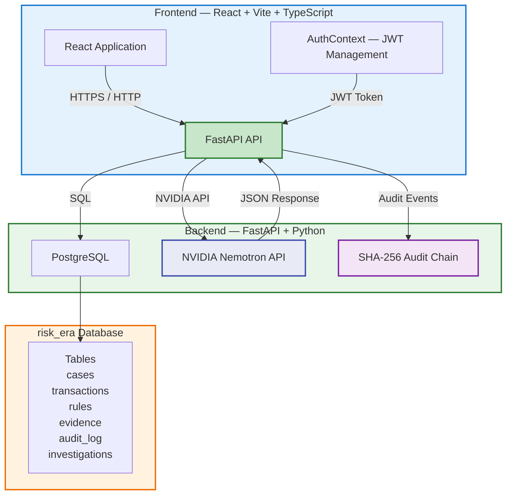

# RISK-ERA

## Demo Video
[▶ Watch the 5-minute walkthrough](PASTE_YOUR_VIDEO_LINK_HERE)
*(Replace with your YouTube/Drive link — confirm it's viewable in an incognito window before submitting.)*

## One-line Description
A transaction investigation system that combines rule-based anomaly detection with NVIDIA Nemotron AI-powered investigation orchestration, delivering explainable risk decisions with full auditability.

## Problem Statement
Financial transaction fraud detection requires both rapid automated response and thorough investigative analysis. Traditional systems either auto-block transactions (risking false positives) or require manual review at scale. Analysts need a system that combines deterministic rule-based filtering with AI-driven evidence gathering and recommendation, while maintaining strict audit trails and data governance.

## Solution
RISK-ERA implements a controlled, auditable investigation workflow where:
- A rule engine flags suspicious transactions and creates case records
- Analysts review cases and trigger AI investigations with a single action
- The Nemotron investigator executes controlled tool calls to retrieve sanitized evidence
- NVIDIA Nemotron generates grounded investigation results with recommendations
- All actions are recorded in a SHA-256 hash-chain audit log
- Role-based access control (JWT/RBAC) enforces ANALYST/ADMIN permissions
- PostgreSQL persistence with atomic transaction management

## Key Features

| Feature | Description |
|---------|-------------|
| **Rule-based Detection** | DSL-driven rule engine with `BLOCK`/`REVIEW` actions |
| **Nemotron Investigation** | NVIDIA Nemotron 3.5 Lightning investigation with controlled tools |
| **Evidence Grounding** | Validated evidence IDs; missing/referenced status tracking |
| **Investigation Persistence** | Atomic commit/rollback; investigation history; feedback loop |
| **Audit Hash Chain** | SHA-256 linked event chain; `verify_chain()` integrity validation |
| **JWT Authentication** | Bearer token auth; ANALYST and ADMIN roles with 30+ permissions |
| **Role-based Authorization** | RBAC: analyst features hidden from admin-only paths and vice versa |
| **Security Headers** | CSP, HSTS, X-Frame, X-Content-Type, Referrer-Policy |
| **Rate Limiting** | 100 requests/60s per IP; HTTP 429; skip /health/ and /ready/ |
| **Input Validation** | UUID format, pagination limits, date range, JSON payload max 1MB |
| **Correlation IDs** | X-Request-ID middleware; preserved in logs and responses |
| **Structured JSON Logging** | request_id, endpoint, case_id, duration_ms; never logs secrets |
| **Docker-ready** | Multi-stage Dockerfiles for backend and frontend |
| **Production Config** | Environment variables: APP_ENV, DATABASE_URL, NVIDIA_API_KEY, JWT_SECRET_KEY, CORS_ORIGINS |

## Architecture



## Investigation Workflow

1. **Rule Engine** processes transaction → anomaly detected → **Case** created (status: OPEN)
2. **Analyst** logs in → **Dashboard** shows open/in-progress/escalated cases
3. **Analyst** opens case → reviews transaction, risk score, initial findings
4. **Analyst** triggers investigation → `POST /api/v1/investigation/{case_id}/run`
5. **Investigator** executes controlled tools → retrieves sanitized evidence
6. **Nemotron** API call → `https://integrate.api.nvidia.com/v1` with `nvidia/nemotron-3.5-lightning-30b-a3b`
7. **InvestigationResult** generated: recommendation, confidence, findings, evidence IDs
8. **Result** persisted to PostgreSQL: case_id, status, model, recommendation, confidence, duration_ms, tool_calls, evidence_ids
9. **Analyst** reviews result → ACCEPT/MODIFY/REJECT with optional reason
10. **Audit event** recorded with hash chain → `verify_chain()` validates integrity

## Technology Stack

| Layer | Technology |
|-------|-----------|
| **Frontend** | React 19, Vite, TypeScript, Axios |
| **Backend** | FastAPI, Python 3.11 |
| **Database** | PostgreSQL 17 (psycopg driver) |
| **AI/ML** | NVIDIA Nemotron 3.5 Lightning 30B A3B |
| **Container** | Docker (multi-stage: backend + frontend) |
| **API** | RESTful JSON over HTTP/1.1 |
| **Validation** | Pydantic models |

## Security Architecture

- **Authentication**: JWT Bearer tokens via `Authorization: Bearer <token>` header
- **Authorization**: Two roles (ANALYST, ADMIN) with 30+ granular permissions
- **API Keys**: NVIDIA API key from `NVIDIA_API_KEY` environment variable only; never hardcoded
- **Secret Management**: All credentials from environment variables; `.env` git-ignored; `.env.example` has placeholders
- **Security Headers**: Content-Security-Policy, Strict-Transport-Security, X-Frame-Options, X-Content-Type-Options, Referrer-Policy
- **Rate Limiting**: 100 req/60s per IP; 429 response; skip /health/ and /ready/
- **Input Validation**: UUID format, pagination (max 100), date range, JSON payload max 1MB
- **Correlation IDs**: X-Request-ID propagated through requests, responses, and structured logs
- **No Secrets in Frontend**: No NVIDIA API key, database credentials, or JWT secrets in browser bundles
- **Frontend-Backend Boundary**: All communication through API endpoints; no direct database access from browser
- **No Direct NVIDIA Access from Frontend**: Nemotron calls go through backend only

## Nemotron Integration

- **Endpoint**: `https://integrate.api.nvidia.com/v1`
- **Model**: `nvidia/nemotron-3.5-lightning-30b-a3b`
- **Authentication**: NVIDIA API key via `NVIDIA_API_KEY` environment variable
- **Workflow**: Investigator → controlled tool calls → evidence grounding → InvestigationResult → PostgreSQL persistence → audit event
- **Result Schema**: InvestigationResult with recommendation (ACCEPT/MODIFY/REJECT), confidence score (0.0-1.0), findings array, evidence IDs list
- **Tool Control**: Investigator executes predefined tools only; LLM does not have direct database access

## Evidence Grounding

- Evidence IDs reference validated data sources
- Status tracking: `valid`, `missing`, `referenced`
- Schema validation ensures evidence consistency across investigation workflow
- Audit log tracks evidence addition, modifications, and verification status
- Invalid or missing evidence IDs are flagged and do not propagate to recommendation

## Persistence

- SQLAlchemy ORM with PostgreSQL
- Alembic migrations for schema evolution (head: a4fc36b9ad5f)
- Atomic investigation sessions: commit on success, rollback on failure
- Pool recycle configuration for connection management
- Investigation records persist with: case_id, status, model, recommendation, confidence, duration_ms, tool_calls, evidence_ids
- History endpoint returns descending investigation history
- Latest result endpoint returns most recent investigation per case

## Analyst Workflow

1. **Login**: `POST /api/v1/auth/login` → JWT token issued
2. **Dashboard**: View metrics (open, in-progress, escalated cases) and case list
3. **Cases**: List cases with filters and status badges
4. **Case Investigation**: View transaction details, risk score, findings, evidence status
5. **Run Investigation**: Trigger Nemotron investigation with one click
6. **Review Result**: See recommendation, confidence, findings, evidence IDs
7. **Submit Feedback**: ACCEPT/MODIFY/REJECT with optional reason
8. **View Audit**: Hash-chain-verified audit trail of all actions

## API Overview

| Method | Endpoint | Description |
|--------|----------|-------------|
| GET | /health | Health check |
| GET | /ready | Readiness (DB + Nemotron status) |
| POST | /api/v1/auth/login | JWT authentication |
| GET | /api/v1/cases/ | List cases (with filters) |
| GET | /api/v1/cases/{id} | Case details |
| POST | /api/v1/investigation/{case_id}/run | Run Nemotron investigation |
| POST | /api/v1/feedback/ | Submit analyst feedback (ACCEPT/MODIFY/REJECT) |
| GET | /api/v1/investigation/{case_id}/history | Investigation history |
| GET | /api/v1/investigation/{case_id}/latest | Latest investigation result |
| GET | /api/v1/audit/ | Audit events with hash chain verification |

**Local Setup**:
```bash
cp backend/.env.example backend/.env  # set DATABASE_URL, NVIDIA_API_KEY, JWT_SECRET_KEY
docker-compose up -d                  # postgres 17
alembic upgrade head                  # from backend/
uvicorn app.main:app --reload         # backend :8000
npm run dev                           # frontend :5173 (VITE_API_BASE_URL=http://127.0.0.1:8000)
# Seed demo users (optional, gated):
DEMO_MODE=true python backend/scripts/seed_demo_users.py
```
**Environment Variables**: See `backend/.env.example` (placeholders only; never commit `.env`)
**Tests**: `python -m pytest tests/test_phase3_intelligence.py -q` etc. individually/batched; see `TEST_RESULTS.md` for last verified counts (e.g., 38/33/21/26/31/18/28/6/7/18 across phase3-10/assistant/auth_security). Full 391-test single invocation can hit session-scoped `clean_db` TRUNCATE lock — run in batches.
**Docker**: See `backend/Dockerfile` and `frontend/risk-era-analyst/Dockerfile`

## Known Limitations

- No RAG/vector search capability
- No Redis caching or Kafka streaming
- No Kubernetes or multi-agent orchestration
- Deployment requires PostgreSQL + Docker + NVIDIA API key
- Frontend requires `VITE_API_BASE_URL` configuration for production use
- Nemotron response quality depends on NVIDIA API availability
- Rule engine is DSL-based; not a learning/ML model
- Single-agent architecture; no multi-agent coordination

## Future Improvements

- Vector search for similar case retrieval
- Redis caching for investigation results
- Kafka event stream for real-time transaction processing
- Multi-agent orchestration for parallel tool execution
- Expanded rule DSL with temporal patterns
- Real-time dashboard WebSockets
- Additional evidence types (web reports, third-party data)

## Verified Metrics (last batched runs)

- **Tests**: phase3 38, phase4 33, phase5 21, phase6 26, phase7 31, phase8 18, phase9 28, phase10_health 6, assistant 7, auth_security 18 — all passed individually (see `TEST_RESULTS.md`); run `pytest` in batches to avoid session-scoped TRUNCATE lock
- **Nemotron**: NVIDIA API integration verified (with `DEMO_MODE=true` fallback for presentation)
- **Audit**: SHA-256 hash chain integrity verified via `verify_chain()`
- **Security**: No hardcoded `nvapi-`/`eyJhbGci` in `frontend/src`; no `?authorization=` handling in app code; auth requires `Authorization: Bearer` JWT; `.env` git-ignored
- **Database**: `alembic upgrade head` successful; schema tests passing
- **Frontend**: `tsc -b && vite build` 0 errors, 99 modules
- **Rate Limiting**: global 1000/60s dev (100 prod) + dedicated `10/min` login / `5/min` register with 429
- **Security Headers**: CSP, HSTS, X-Frame, X-Content-Type, Referrer-Policy, X-Request-ID
